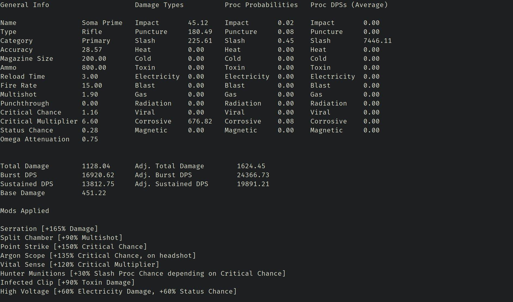
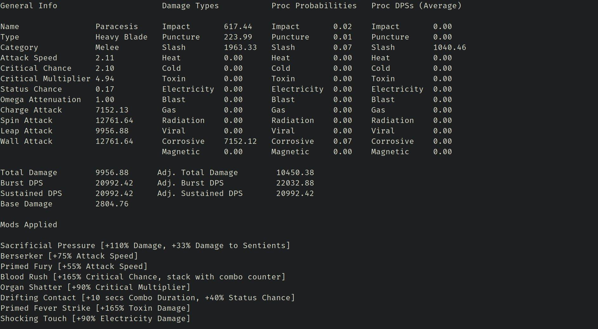
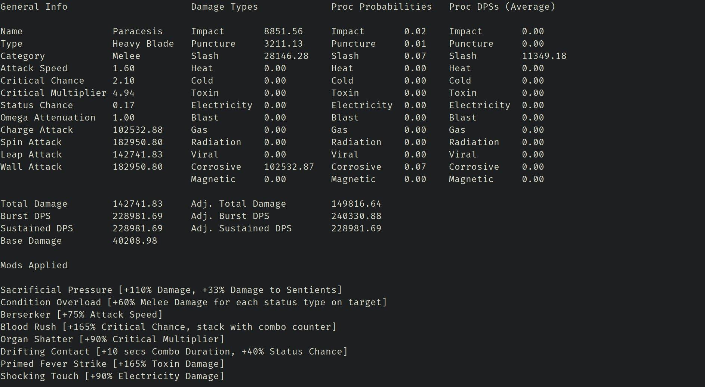
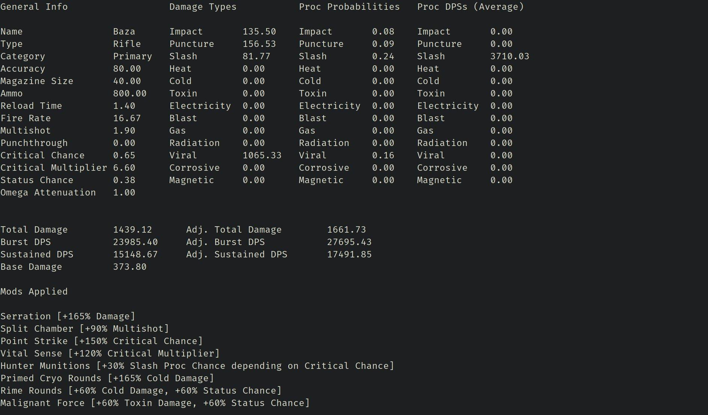
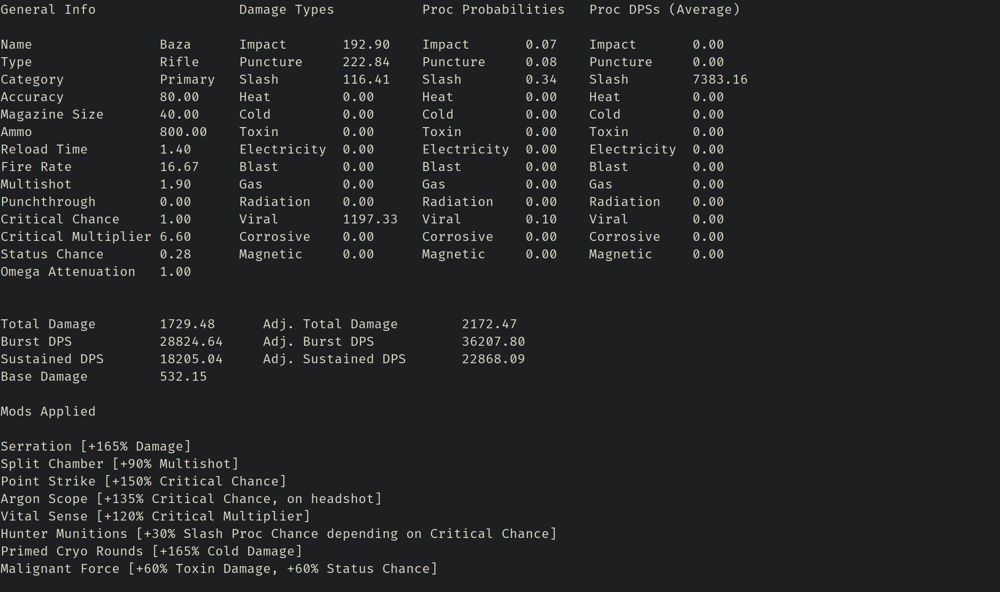
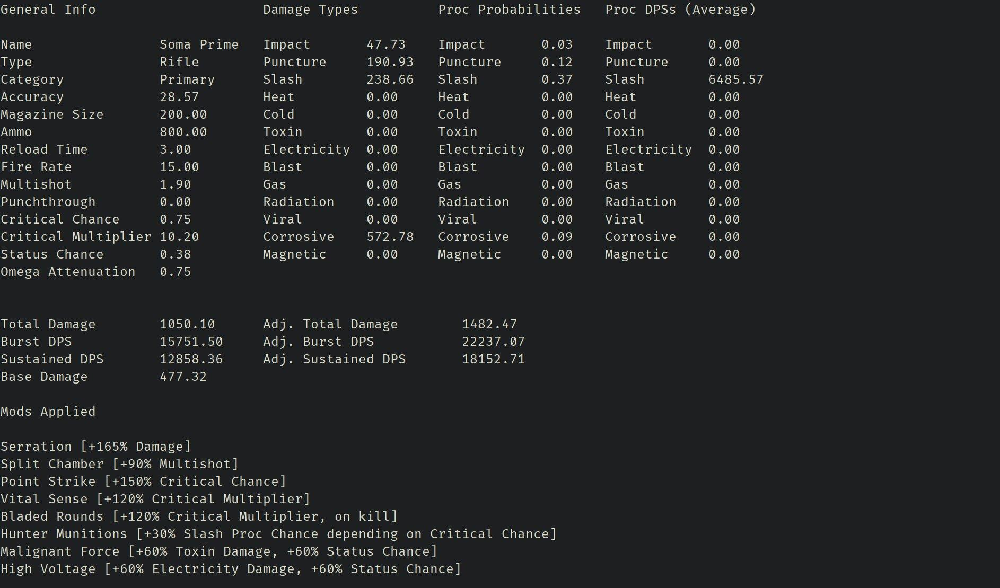

# Warframe-AutoBuilder


[](https://travis-ci.org/verystable/warframe-autobuilder)
[](https://opensource.org/licenses/BSD-3-Clause)
[](https://github.com/verystable/warframe-autobuilder/tags)

A auto-builder for Warframe weapons!
  
**Table of Contents**

- [Installation](#installation)
  - [Cloning the repository](#cloning-the-repository)
  - [Installing Warframe-AutoBuilder](#installing-Warframe-AutoBuilder)
    - [Installing `stack`](#installing-stack)
    - [Installing `Warframe-AutoBuilder`](#installing-Warframe-AutoBuilder)
- [Usage](#usage)
  - [As a typical builder](#as-a-typical-builder)
	- [Example command](#example-command)
  - [As a typical melee builder](#as-a-typical-melee-builder)	
  	- [Example command with Combo Multiplier](#example-command-with-combo-multiplier)
  	- [Example command with Condition Overload](#example-command-with-condition-overload)	
  - [As an auto-builder](#as-an-auto-builder)
	- [Command for auto-building](#command-for-auto-building)
  - [Caution](#caution)
  - [Comparators](#comparators)	
- [Source Directory Tree](#source-directory-tree)
- [Adding a Mod](#adding-a-mod)
  - [Location and identification](#location-and-identification)
  - [Listing the configuration](#listing-the-configuration)
  - [Understanding function arguments](#understanding-function-arguments)
  - [Parts Configuration](#parts-configuration)
  - [Final Configuration](#final-configuration)
  - [Application List](#application-list)
  - [Testing](#testing)
- [Adding a new Weapon](#adding-a-new-weapon)

  
## Installation

### Cloning The Repository

If you know your way around git, skip to next section.

1. Install `git` 
   * You can use your distro's package manager
   * For Windows you can visit [gitforwindows](https://gitforwindows.org/)
   * For Mac you can visit [gitformac](https://git-scm.com/download/mac)
2. Copy the repository link by clicking on the `clone` button and choosing which method you want to use.
3. Open `terminal` or `git bash` or `cmd` depending on your system and type  
   `git clone <copied link>`
   
### Installing Warframe Autobuilder

`Warframe-AutoBuilder` is written in Haskell so you'll need a Haskell compiler and some other stuff.  
Luckily there's a magical tool called `stack`, and it can take care of all the stuff for you!  

#### Installing `stack`

1. For most Un*x OSs, the easiest way to install stack is via your distro's package manager
   * or by running  
     `curl -sSL https://get.haskellstack.org/ | sh`  
     or  
     `wget -q0- https://get.haskellstack.org/ | sh`  
   * For Windows or Mac, checkout the [stack install and upgrade](https://docs.haskellstack.org/en/stable/install_and_upgrade/) section.
2. Get yourself familiar with `stack` by going over the [stack README](https://docs.haskellstack.org/en/stable/README/)

#### Installing `Warframe-AutoBuilder`

1. `cd` to the cloned `Warframe-AutoBuilder` directory  
2. Run `stack build`  
   This will build the project.
3. Run `stack test`  
   This will run the test suite.
4. If the process is successful, run `stack install`  

If you haven't installed `ghc` or any Haskell related library or project the first install might seem long.  
Also `stack` can be very verbose.  
But don't worry the subsequent builds and runs will be much faster!  

If you want to see how the install process would look like, check out the CI/CD terminal.
[](https://travis-ci.org/verystable/warframe-autobuilder)

## Few things to remember

Warframe-AutoBuilder looks for data files in `warframe-autobuilder-data` folder in `$HOME/.config/` directory.  
For most Un*x OSs it's your `config` directory and for Windows users it's your home path.  
So move `<cloned repo directory>/warframe-autobuilder-data` to `$HOME/.config/`  
For Windows users move the directory to `<user-name>/.config/`.  
If `.config` directory doesn't exist already, you'll have to create it.  
If you're not sure where to put the directory, dry run the application,  
the error message you'll get will specify where Warframe-AutoBuilder is trying to look for those data files.  
For example,

``` 
autobuilder -w "Tigris Prime" -b "Primed Point Blank"
```

reports  

``` 
Please copy directory
'<cloned repo location>/warframe-autobuilder-data'
to
'.config/warframe-autobuilder-data'
---------------------------------------------------
autobuilder: /home/<my-user-name>/.config/warframe-autobuilder-data/Primary_Weapons/Tigris_Prime: openBinaryFile: does not exist (No such file or directory)

```
that it is looking for `Tigris_Prime` file in `/home/<my-user-name>/.config/warframe-autobuilder-data`.  
This path may be unique to your machine so try it out yourself.  

## Usage

The builder loosely is based upon the idea of ['Expected value'](https://en.wikipedia.org/wiki/Expected_value).
So stats like total damage, proc dps, etc. may not look exactly like in the arsenal UI.

Because every weapon has 'damage', [GenericDamage](https://github.com/verystable/Warframe-AutoBuilder/blob/master/src/Types/GenericWeapon.hs) is made an instance of MonoFunctor.

### As a typical builder

#### Example command

```
autobuilder
	-w "Soma Prime"
	-b " Serration
	, Split Chamber
	, Point Strike
	, Vital Sense
	, Argon Scope
	, Hunters Munition
	, Infected Clip
	, High Voltage"
```

#### Output



### As a typical melee builder

#### Example command with Combo Multiplier

For Paracesis at 3.5x combo multiplier

```
autobuilder 
	-w "Paracesis"
	-b " Sacrifical Pressure
	, Primed Fury
	, Organ Shatter
	, Blood Rush
	, Primed Fever Strike
	, Shocking Touch
	, Drifting Contact
	, Berserker" 
	-m 3.5
```

#### Output



#### Example command with Condition Overload

For Paracesis at 3.5x combo multiplier and 3 status procs affecting the enemy (Condition Overload)

```
autobuilder 
	-w "Paracesis"
	-b " Sacrifical Pressure
	, Condition Overload
	, Organ Shatter
	, Blood Rush
	, Primed Fever Strike
	, Shocking Touch
	, Drifting Contact
	, Berserker"
	-m 3.5
	-g 14.336
```

`14.336` is a generic multiplier, so it'll be `(1.6 ^ number of procs on the enemy) * combo counter`
To get `+33%` to sentinel damage bonus, just add `33%` to both of the multipliers.

#### Output



### As an auto-builder

This is the interesting part!  
Say you want to build Baza for high sustained DPS and Viral-Slash.  
You might go for a build like this  

``` 
Serration
Split Chamber
Point Strike
Vital Sense
Rime Rounds
Malignant Force
Hunters Munition
_____________

```

but you don't know which mods would be best for that last slot.  

This is what you can do  

#### Command for auto-building

Tell `autobuilder` which mods you definitely want  

```
[-b|--build]

<previous command> 
	-b " Serration
	, Split Chamber
	, Point Strike
	, Vital Sense
	, Rime Rounds
	, Malignant Force
	, Hunters Munition"
```

and which mods you definitely do not want


``` 
[-i|--ignore]

<previous command> 
	-i " Amalgam Serration
	, Primed Infected Clip
	, Primed Hellfire
	, Primed Stormbringer"

```

and what property of the weapon you want to max out!

``` 
[-c|--comparator]

<previous command> -c "adjusted sustained dps"

```

final command would look like this

``` 
autobuilder 
	-w "Baza" 
	-b " Serration
	, Split Chamber
	, Point Strike
	, Vital Sense
	, Rime Rounds
	, Malignant Force
	, Hunters Munition
	"
	-i " Amalgam Serration
	, Primed Infected Clip
	, Primed Hellfire
	, Primed Stormbringer
	"
	-c "adjusted sustained dps"
```

#### Output



which tells you the best mod will be `Primed Cryo Rounds`

You can see now your build has two `cold` damage mods. What if you wanted to keep `Primed Cryo Rounds` and replace `Rime Rounds` to max out `Sustained DPS`?

This is what you can do

``` 
autobuilder 
	-w "Baza"
	-b " Serration
	, Split Chamber
	, Point Strike
	, Vital Sense
	, Primed Cryo Rounds
	, Malignant Force
	, Hunters Munition
	"
	-i " Amalgam Serration
	, Primed Infected Clip
	, Primed Hellfire
	, Primed Stormbringer
	, Rime Rounds
	"
	-c "adjusted sustained dps"
```

#### Output



Lets try this for a different comparator.

You want to build Soma Prime for maximum `Corrosive Status Proc Chance`

``` 
autobuilder 
	-w "Soma Prime" 
	-b " Serration
	, Split Chamber
	, Point Strike
	, Vital Sense
	, Bladed Rounds
	, Hunter Munitions"
	-i " Amalgam Serration
	, Primed Infected Clip
	, Primed Hellfire
	, Primed Stormbringer"
	-c "corrosive proc chance"

```

#### Output



## Caution


Autobuilding given a comparator compares every possible build.  
So if there are 51 mods and you only put one mod in `-b`'s argument, that'll mean autobuilder will have to compare `50 choose 7` different builds.  
That's a total of `99,88,44,00` builds.  
So if you don't want your PC to turn into an impromptu room heater, I'll recommend giving autobuilder 3 or more mods to work with.  

## Comparators

``` 
[-c|--comparator]
```

You can use any property of the weapon to compare on.

For example:

``` haskell

* Total Damage
* Adjusted Total Damage
* Sustained DPS
* Adjusted Sustained DPS
* Burst DPS
* Adjusted Burst DPS
* [Physical or Elemental Damage] Proc Chance
* [Physical or Elemental Damage] Proc DPS
* Ammo
* Magazine Size
* Base Damage
* Fire Rate
* Leap Attack
* ...

```

## Source Directory Tree

```

src
├── ArgInterface
│   ├── ArgInterface.hs
│   ├── MeleeWeapons.hs
│   ├── ModsMapper
│   │   ├── MeleeModsMapper.hs
│   │   ├── PistolModsMapper.hs
│   │   ├── RifleModsMapper.hs
│   │   └── ShotgunModsMapper.hs
│   ├── PistolWeapons.hs
│   ├── RifleWeapons.hs
│   ├── ShotgunWeapons.hs
│   ├── WeaponDataDirectoryTest.hs
│   └── WeaponDetailsIdentifier.hs
├── AutoBuilder.hs
├── Builder
│   ├── Applicator
│   │   ├── MeleeModApplicator.hs
│   │   ├── PistolModApplicator.hs
│   │   ├── PostBuildSetup.hs
│   │   ├── RifleModApplicator.hs
│   │   └── ShotgunModApplicator.hs
│   └── Mods
│       ├── MeleeMods
│       │   ├── AmmoMods.hs
│       │   ├── AttackSpeedMods.hs
│       │   ├── CriticalChanceMods.hs
│       │   ├── CriticalMultiplierMods.hs
│       │   ├── DamageMods.hs
│       │   ├── ElementalDamageMods.hs
│       │   ├── MagazineMods.hs
│       │   ├── MultishotMods.hs
│       │   ├── PhysicalDamageMods.hs
│       │   ├── RivenMods.hs
│       │   ├── SpecialMods.hs
│       │   └── StatusMods.hs
│       ├── MeleeModsMetaList.hs
│       ├── PistolMods
│       │   ├── AmmoMods.hs
│       │   ├── CriticalChanceMods.hs
│       │   ├── CriticalMultiplierMods.hs
│       │   ├── DamageMods.hs
│       │   ├── ElementalDamageMods.hs
│       │   ├── FireRateMods.hs
│       │   ├── MagazineMods.hs
│       │   ├── MultishotMods.hs
│       │   ├── PhysicalDamageMods.hs
│       │   ├── RivenMods.hs
│       │   ├── SpecialMods.hs
│       │   └── StatusMods.hs
│       ├── PistolModsMetaList.hs
│       ├── RifleMods
│       │   ├── AmmoMods.hs
│       │   ├── CriticalChanceMods.hs
│       │   ├── CriticalMultiplierMods.hs
│       │   ├── DamageMods.hs
│       │   ├── ElementalDamageMods.hs
│       │   ├── FireRateMods.hs
│       │   ├── MagazineMods.hs
│       │   ├── MultishotMods.hs
│       │   ├── PhysicalDamageMods.hs
│       │   ├── RivenMods.hs
│       │   ├── SpecialMods.hs
│       │   └── StatusMods.hs
│       ├── RifleModsMetaList.hs
│       ├── ShotgunMods
│       │   ├── AmmoMods.hs
│       │   ├── CriticalChanceMods.hs
│       │   ├── CriticalMultiplierMods.hs
│       │   ├── DamageMods.hs
│       │   ├── ElementalDamageMods.hs
│       │   ├── FireRateMods.hs
│       │   ├── MagazineMods.hs
│       │   ├── MultishotMods.hs
│       │   ├── PhysicalDamageMods.hs
│       │   ├── RivenMods.hs
│       │   ├── SpecialMods.hs
│       │   └── StatusMods.hs
│       └── ShotgunModsMetaList.hs
├── ComprehensiveWeapon
│   ├── ComprehensiveFunctions.hs
│   ├── ModMultiplierFunctions
│   │   ├── ColdModMultiplier.hs
│   │   ├── ElectricityModMultiplier.hs
│   │   ├── HeatModMultiplier.hs
│   │   └── ToxinModMultiplier.hs
│   ├── ProcChances.hs
│   ├── ProcDamages.hs
│   └── SpecialAddativeFunctions.hs
├── GenericFunctions
│   └── GenericFunctions.hs
├── ModMaker
│   └── ModMaker.hs
├── Printer
│   ├── ComprehensiveWeaponPrinter.hs
│   ├── MeleePrinter.hs
│   ├── PistolPrinter.hs
│   ├── RiflePrinter.hs
│   └── ShotgunPrinter.hs
├── Ranker
│   ├── ComparatorsGenerator.hs
│   ├── Comparators.hs
│   ├── Ranker.hs
│   └── WeaponRankers.hs
└── Types
    ├── ComprehensiveWeapon.hs
    ├── GeneralTypes.hs
    └── GenericWeapon.hs

16 directories, 91 files
``` 

## Adding a Mod

Adding a (new/custom/Riven) mod can be done in 5 steps.  
1. [Location and identification](#location-and-identification)
2. [Listing the configuration](#listing-the-configuration)
3. [Understanding function arguments](#understanding-function-arguments)
4. [Parts Configuration](#parts-configuration)
5. [Final Configuration](#final-configuration)

Lets take a look at an example.  
We want to add a mod 'Rapid Fire'  
for `Rifles`  
with stats `RapidFire [+60% Heat Damage, -90% Reload Time]`  

### Location and identification

1. Categorize the mod
   * This mod can be categorized as an 'elemental damage' mod or a 'reload speed' mod.  
	 Going by a general priority list, adding extra Heat damage will change the weapon more significantly  
	 than reducing reload time. So this mod can be classified under 'elemental damage' mod.  
2. Locating the mod.
   * To add this mod to its appropriate location, we first need to find the relavent file.  
	 Mods files are in `src/Builder/Mods` directory.  
	 There are different directories for each kind of mod.  
	 For this perticular mod, we'll need to go to `src/Builder/Mods/RifleMods/ElementalDamageMods.hs`  
3. Dividing the mod.
   * Since this mod lists two modification to the weapon  
	 `+60% Heat Damage` and `-90% Reload Time`  
	 you'll need to 'compose' these two different configuration into one mod.  
	 Lets calls the first configuration `rapidFire1`  
	 and the second configuration `rapidFire2`.  
	 
### Listing the configurations

The mods backend file is `src/GenericFunctions/GenericFunctions.hs`.  

`rapidFire1 [+60% Heat Damage]` configuration will add 60% extra Heat damage to the weapon.  
Basically this mod should take a weapon's base damage, multiply it by 0.6 and add the number back.  
The other stuff like increasing the proc damage, base damage, total damage, proc DPS  
and all the other things this mod will change, will be handeled internally  
and you **won't** have to change each single one manually.  

So we need 4 things.  

1. The weapon stat to set.  
   * In this case, it is the weapon's heat damage, the function for that is `gdHeat`  
	 (mnemonically: generic damage heat).  
2. The weapon stat to get.  
   * That will be the total base damage `gwBaseDamage`  
	 (mnemonically: generic weapon base damage).  
3. The modifier.  
   * Which is `0.6` (60% means 0.6x)  
4. The direction.  
   * The direction is either positive or negative.  
	 If the modifier to the function is going to increase the stat, it'll be `+`, otherwise `-`.  
	 
### Understanding function arguments

No matter how the mod is going to work, it should always have two arguments  
`baseWeapon (targetWeapon, mods)`  
or  
`baseWeapon targetWeapon`  

### Parts configuration

Because `gdHeat` or just heat damage is a damage property of a weapon, we need `modifyDamageProperty` function from  
`src/GenericFunctions/GenericFunctions`  

Going by its documentation, we need  

1. Property to set -> heat damage or `gdHeat`  
2. Value to base on -> weapon's base damage or `targetWeapon ^. gdBaseDamage`  
3. Multiplier -> 60% or 0.6x or `0.6`  
4. Operator to apply -> `+`  
5. Weapon to set -> `targetWeapon` (Look at [Understanding Function arguments](#understanding-function-arguments))  

So this is our first configuration.  

``` haskell

rapidFire1 baseWeapon targetWeapon = 
	modifyDamageProperty
		gdHeat
		(targetWeapon ^. gwBaseDamage) 
		(Just 0.6) 
		(+) 
		targetWeapon

```

where `Just` is a type constructor or `Maybe` type.  
Also `(targetWeapon ^. gwBaseDamage)` means base the `gdHeat` value upon the current base damage.  
If we wanted to set a base damage type which could be slash or impact or puncture, or in some cases heat (eg. Ignis)  
the base value to set from would have been `(baseWeapon ^. gwBaseDamage)`.  

our second configuration need us to modify a general property so we'll need `modifyGeneralProperty` function from  
`src/GenericFunctions/GenericFunctions`  
backend.  

Going by its documentation, we need  

1. Property to set -> reload speed or `gwReloadTime`  
2. Value to base on -> weapon's base reload time or `baseWeapon ^. gwReloadTime`  
3. Multiplier -> 90% or 0.9x or `0.9`  
4. Operator to apply -> `-` (Because increase in reload speed is a decrease in realod time)  
5. Weapon to set -> `targetWeapon` (Look at [Understanding Function arguments](#understanding-function-arguments))  

And this is our second configuration.

``` haskell

rapidFire2 baseWeapon targetWeapon =
	modifyGeneralProperty
		gwReloadTime
		(baseWeapon ^. gwReloadTime)
		(Just 0.9)
		(-)
		targetWeapon

```

### Final configuration

These are our two configuration.

``` haskell

rapidFire1 baseWeapon targetWeapon = 
	modifyDamageProperty
		gdHeat
		(targetWeapon ^. gwBaseDamage) 
		(Just 0.6) 
		(+) 
		targetWeapon
		

rapidFire2 baseWeapon targetWeapon =
	modifyGeneralProperty
		gwReloadTime
		(baseWeapon ^. gwReloadTime)
		(Just 0.9)
		(-)
		targetWeapon		

```

Our final mod would be  

``` haskell
rapidFire baseWeapon (targetWeapon, mods) =
	( rapidFire1 baseWeapon $ rapidFire2 baseWeapon targetWeapon
	, "Rapidfire [+60% Heat Damage, +90% Reload Speed]" : mods
	)

```

where this first part  

``` haskell

rapidFire1 baseWeapon $ rapidFire2 baseWeapon targetWeapon

```

is a combination of  

``` haskell

rapidFire1 baseWeapon targetWeapon
```
and  

``` haskell
rapidFire2 baseWeapon targetWeapon
```

because `rapidFire2` applied on argument produces a new weapon, that result is then passed into `rapidFire2`  
giving us  

``` haskell

rapidFire1 baseWeapon $ rapidFire2 baseWeapon targetWeapon

```

A mod has the type `Build`

so this part

``` haskell
"Rapidfire [+60% Heat Damage, +90% Reload Speed]" : mods
```

adds `"Rapidfire [+60% Heat Damage, +90% Reload Speed]"` to the list of mods.

### Application List

Now that we've made and configured our mod, it's time to add it to the application list!  
An application list is a list of tuples of mod's name and the matching mod function.  
Because this is a rifle mod, we'll add `Rapidfire` to `src/Builder/Mods/RifleModsMetaList.hs`.  
In the `Elemental Damage Mods` section, write at the bottom  

``` haskell

, ...
, ("cryoRounds", cryoRounds wep)
, ...
, ...
, ("rapidFire", rapidFire wep)

```

The line `("rapidFire", rapidFire wep)` basically means a mod name "rapidFire" applies function `rapidFire` on a weapon `wep`.  

### Testing

We're done! All we need to do now is test the mod out.  
For our modifications to take effect, we'll need to rebuild and reinstall.  
Redo the steps in [Installing `Warframe-AutoBuilder`](#installing-Warframe-AutoBuilder-1)  
And the mod should be available to build with!  

``` 
<previous command> 
	-b " Serration
	, ...
	, ...
	, RapidFire
	, ...
	, ..."
	
```

## Adding a New Weapon

To add a new weapon simply go to `.config/warframe-autobuilder-data/<weapon-category>`, copy any weapon file and paste it as the weapon name.

For example say we want to add a new weapon `NewRifle`.

We'll copy `Amprex` from `.config/warframe-autobuilder-data/Primary_Weapons/Amprex` and paste it as `NewRifle` as `.config/warframe-autobuilder-data/Primary_Weapons/NewRifle`  

Each of those weapon files are encoded in `json` so you can open those files in any text editor and put in the `NewRifle` stats.  

Finally add `NewRifle` to `RifleWeapons.hs` in `src/ArgInterface/RifleWeapons.hs`  

